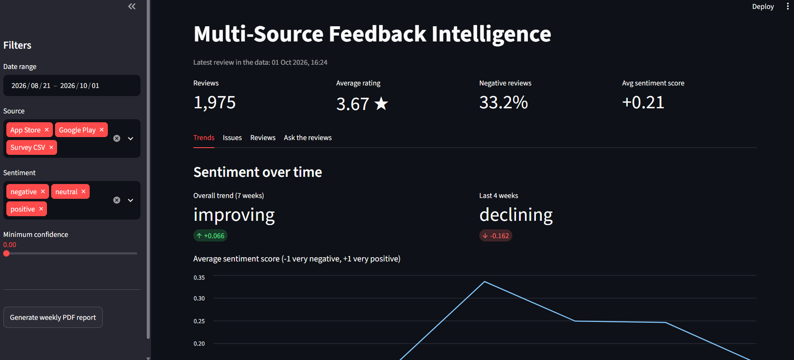
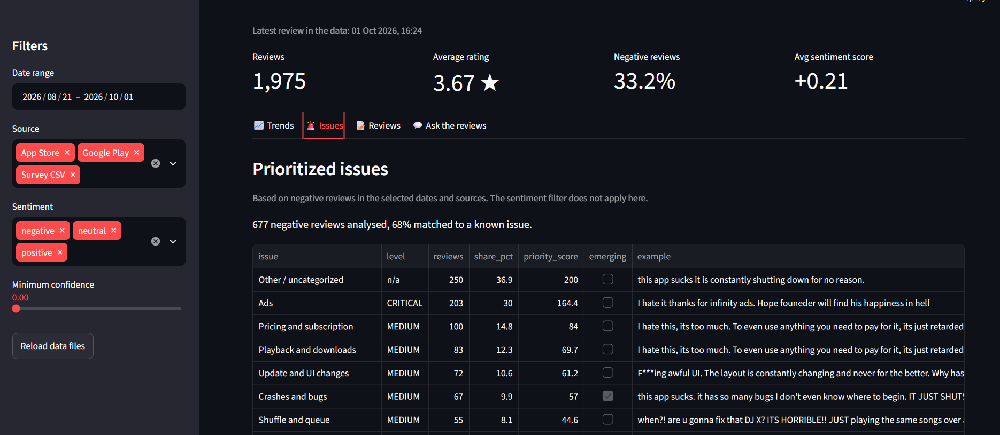

# Multi-Source Feedback Intelligence System

A Python system that collects app reviews from several sources, measures customer sentiment, detects trends, ranks recurring problems by priority, and presents everything in a Streamlit dashboard with downloadable weekly PDF reports. It also includes an "Ask the reviews" feature: ask a question in plain English and an AI model answers it using the most relevant reviews.

The example app analysed throughout this project is **Spotify**, but the system works for any app with a Google Play and App Store listing.

**Author:** *Abhinav Shukla*
**Live demo:**[Open the dashboard](https://spotify-feedback-intelligencee.streamlit.app/
)

---

## Table of contents

1. [What it does](#what-it-does)
2. [Screenshots](#screenshots)
3. [How it works](#how-it-works)
4. [Project structure](#project-structure)
5. [Tech stack](#tech-stack)
6. [Setup](#setup)
7. [Running the project](#running-the-project)
8. [Using the dashboard](#using-the-dashboard)
9. [Methodology](#methodology)
10. [Configuration](#configuration)
11. [Testing and evaluation](#testing-and-evaluation)
12. [Error handling](#error-handling)
13. [Sample findings](#sample-findings)
14. [Known limitations](#known-limitations)
15. [Troubleshooting](#troubleshooting)
16. [Deployment](#deployment)
17. [Future improvements](#future-improvements)
18. [Data and privacy](#data-and-privacy)

---

## What it does

| Capability | Description |
|---|---|
| **Multi-source collection** | Google Play reviews (via the `google-play-scraper` library), App Store reviews (via Apple's public RSS feed), and CSV exports from survey tools. |
| **Common data format** | Every source is converted to the same columns (`source`, `review_id`, `date`, `rating`, `text`, `author`, `app_version`) so they can be combined and compared. |
| **Cleaning and chunking** | Removes broken rows, links, emojis and duplicates; keeps English reviews; splits long reviews into smaller pieces so mixed reviews are judged part by part. |
| **Sentiment analysis** | A RoBERTa model classifies each piece as negative, neutral or positive and returns a **confidence score**. Chunk results are averaged back to one result per review. |
| **Trend detection** | Weekly (or daily, for short data) average sentiment, with an overall verdict (improving, declining, stable) and a separate verdict for the last 4 periods. |
| **Issue prioritization** | Negative reviews are grouped into 11 problem categories and ranked by frequency and severity, with CRITICAL / HIGH / MEDIUM / LOW levels and an "emerging" flag for fast-growing problems. |
| **Semantic search + AI answers** | Reviews are embedded and stored in a vector database. Questions retrieve the most relevant reviews, and an LLM writes a short answer that cites them. |
| **Streamlit dashboard** | Filters for date range, source, sentiment and minimum confidence; metric cards; trend charts; issue table; review browser; question box. |
| **Weekly PDF report** | Auto-written takeaways, week-over-week comparison table, charts and a top-issues table with example reviews. |
| **Tests and evaluation** | 13 automated tests plus an evaluation script measuring sentiment agreement, retrieval relevance and speed. |

---

## Screenshots

Add your screenshots to a `docs/screenshots/` folder and these links will display them.






---

## How it works

```
 Google Play ──┐
 App Store RSS ─┼─►  collect_data.py  ─►  data/all_reviews.csv
 Survey CSV  ──┘      (common schema)
                              │
                              ▼
                 analysis/preprocess.py  ─►  data/clean_reviews.csv
                              │
                              ▼
                 analysis/chunking.py    ─►  data/review_chunks.csv
                              │
              ┌───────────────┴────────────────┐
              ▼                                ▼
   analysis/embeddings.py            analysis/sentiment.py
   (vectors → Chroma database)       ─► data/chunk_sentiment.csv
   data/chroma_db                    ─► data/review_sentiment.csv
              │                                │
              │                      ┌─────────┴─────────┐
              │                      ▼                   ▼
              │            analysis/trends.py     analysis/issues.py
              │            data/sentiment_trend   data/prioritized_issues
              │                      │                   │
              ▼                      └─────────┬─────────┘
   analysis/ai_engine.py                       ▼
   (retrieve + LLM answer)          reports/report_generator.py ─► weekly PDF
              │                                │
              └────────────────┬───────────────┘
                               ▼
                     app.py (Streamlit dashboard)
```

Each stage reads the file written by the previous stage, so any stage can be re-run on its own.

---

## Project structure

```
feedback-intelligence/
├── app.py                      # Streamlit dashboard
├── collect_data.py             # Runs all fetchers, merges, cleans, saves
├── evaluate.py                 # Sentiment / retrieval / speed evaluation
├── requirements.txt            # Python dependencies
├── requirements-dev.txt        # Testing tools (pytest)
├── .env                        # Your API key (NOT committed to Git)
├── .gitignore
├── README.md
│
├── fetchers/                   # One module per data source
│   ├── playstore.py            # Google Play reviews (newest + deep history)
│   ├── appstore.py             # App Store reviews via Apple's RSS feed
│   └── csv_loader.py           # Survey CSV import with a column map
│
├── analysis/                   # Processing and intelligence
│   ├── preprocess.py           # Cleaning and normalization
│   ├── chunking.py             # Splitting long reviews
│   ├── embeddings.py           # Embeddings + Chroma vector database
│   ├── sentiment.py            # Sentiment labels and confidence scores
│   ├── trends.py               # Trend detection over time
│   ├── issues.py               # Issue tagging and prioritization
│   └── ai_engine.py            # Retrieval + LLM answers (Groq)
│
├── reports/
│   └── report_generator.py     # Weekly PDF report
│
├── tests/
│   └── test_pipeline.py        # Automated tests
│
└── data/                       # Generated data (CSV files and Chroma database)
    └── sample_survey.csv       # Small example survey export
```

---

## Tech stack

| Area | Tool |
|---|---|
| Language | Python 3.14 (tested on 3.14.6, Windows) |
| Google Play data | `google-play-scraper` |
| App Store data | Apple customer-reviews RSS feed, via `requests` |
| Data handling | `pandas`, `numpy` |
| Text splitting | `langchain-text-splitters` (Recursive Character Splitter) |
| Embeddings | `sentence-transformers`, model `all-MiniLM-L6-v2` |
| Vector database | `chromadb` (cosine similarity) |
| Sentiment model | `transformers`, model `cardiffnlp/twitter-roberta-base-sentiment-latest` |
| LLM | Groq API, model `openai/gpt-oss-120b` (fallback `openai/gpt-oss-20b`) |
| Dashboard | `streamlit` |
| PDF and charts | `reportlab`, `matplotlib` |
| Testing | `pytest` |

---

## Setup

### 1. Requirements

- Python 3.9 or newer (the project was developed on 3.14.6)
- Git
- About 2 GB of free disk space (the AI models are downloaded on first use: roughly 90 MB for the embedding model and 500 MB for the sentiment model)
- A free Groq account for the "Ask the reviews" feature (see step 5)

### 2. Get the code

```bash
git clone https://github.com/abhinavshukla18/feedback_intelligence_multi_source_hidevs.git
cd feedback_intelligence_multi_source_hidevs
```

### 3. Create and activate a virtual environment

A virtual environment keeps this project's libraries separate from everything else on your computer.

```bash
python -m venv venv
```

Activate it:

- **Windows (PowerShell or Command Prompt):** `venv\Scripts\activate`
- **Mac / Linux:** `source venv/bin/activate`

You should see `(venv)` at the start of your terminal line. Activate it again every time you open a new terminal for this project.

### 4. Install the dependencies

```bash
python -m pip install -r requirements.txt
```

This installs several large libraries (including PyTorch through `sentence-transformers`), so it can take a few minutes. Using `python -m pip` instead of plain `pip` guarantees the libraries go into the same Python that runs the project.

### 5. Add your Groq API key

The question box ("Ask the reviews") uses a language model hosted by Groq. Everything else in the project works without a key.

1. Create a free account at **console.groq.com**.
2. Open **API Keys** and click **Create API Key**. Copy the key (it starts with `gsk_`; it is shown only once).
3. In the project's top-level folder, create a file named exactly `.env` containing one line:

```
GROQ_API_KEY=gsk_your_key_here
```

No quotes, no spaces around the `=`. The `.env` file is listed in `.gitignore`, so it is never uploaded to GitHub. **Never share your key or commit it.**

### 6. Optional: Hugging Face token

On the first run, downloading models prints a warning about unauthenticated requests. It is harmless. To remove it and get faster downloads, create a free token at huggingface.co and set an environment variable named `HF_TOKEN`.

---

## Running the project

All commands are run from the project's top-level folder with the virtual environment active.

> **Important:** modules inside the `analysis` and `reports` folders are run with `python -m folder.module` (no `.py`), not `python folder/module.py`. The `-m` form lets the modules import each other.

### Quick start (data already in the repository)

The repository includes the processed data files and the vector database, so you can launch the dashboard immediately:

```bash
streamlit run app.py
```

### Full pipeline (collect fresh data)

Run these in order, one at a time. Each step reads the previous step's output.

| # | Command | What it does | Output | Time |
|---|---|---|---|---|
| 1 | `python collect_data.py` | Fetches Google Play history (default: last 42 days, up to 60 reviews per day), the newest ~500 App Store reviews, and the sample survey CSV; merges and de-duplicates | `data/all_reviews.csv` | 2 to 10 min |
| 2 | `python -m analysis.preprocess` | Cleans text, removes invalid, short, non-English and duplicate reviews, adds `clean_text` and week columns | `data/clean_reviews.csv` | seconds |
| 3 | `python -m analysis.chunking` | Splits long reviews into overlapping chunks | `data/review_chunks.csv` | seconds |
| 4 | `python -m analysis.embeddings` | Embeds all chunks and stores them in Chroma; runs 3 test searches | `data/chroma_db/` | 1 to 3 min |
| 5 | `python -m analysis.sentiment` | Scores every chunk and review | `data/chunk_sentiment.csv`, `data/review_sentiment.csv` | 5 to 20 min |
| 6 | `python -m analysis.trends` | Prints weekly sentiment and trend verdicts | `data/sentiment_trend.csv` | seconds |
| 7 | `python -m analysis.issues` | Tags and ranks issues | `data/prioritized_issues.csv` | seconds |
| 8 | `python -m reports.report_generator` | Builds the weekly PDF | `reports/weekly_report_YYYY-MM-DD.pdf` | seconds |
| 9 | `streamlit run app.py` | Starts the dashboard at `http://localhost:8501` | | |

Each fetcher can also be tested alone, for example `python fetchers/playstore.py`.

### Using a different app

- **Google Play:** change `SPOTIFY_APP_ID` in `fetchers/playstore.py` (the ID is the part after `id=` in the Play Store URL).
- **App Store:** change `SPOTIFY_APP_ID` in `fetchers/appstore.py` (the number after `/id` in the App Store URL).
- Update the app name in `analysis/ai_engine.py` (the system prompt) and the report title in `reports/report_generator.py`.

### Using your own survey export

Place the CSV in `data/` and edit `DEFAULT_COLUMN_MAP` in `fetchers/csv_loader.py` so it maps our fields to your file's column names:

```python
DEFAULT_COLUMN_MAP = {
    "date": "date",       # your date column
    "rating": "rating",   # your numeric rating column
    "text": "comment",    # your free-text column
    "author": "name",     # optional
}
```

Then point `csv_path` in `collect_data.py` at your file.

---

## Using the dashboard

Start it with `streamlit run app.py`. To stop it, click the terminal and press **Ctrl + C**.

**Sidebar filters** (apply to the metric cards, Trends and Reviews tabs):

- **Date range**: restrict to a period.
- **Source**: Google Play, App Store, Survey CSV, or any combination.
- **Sentiment**: negative, neutral, positive.
- **Minimum confidence**: hide reviews the model is unsure about (below 0.6 is unreliable; see evaluation results).
- **Reload data files**: clears the cache after you re-run the pipeline.
- **Generate weekly PDF report**: builds the report and offers a download button.

**Tabs:**

| Tab | Contents |
|---|---|
| **Trends** | Overall verdict and last-4-periods verdict, average sentiment line chart, percentage-negative bar chart. Uses only sources with at least 14 days of history. |
| **Issues** | Prioritized issue table (level, reviews, share, priority score, emerging flag, example review) and a priority chart. Based on negative reviews in the selected dates and sources. |
| **Reviews** | Searchable table of individual reviews with sentiment and confidence. |
| **Ask the reviews** | Type a question such as "What do people say about login problems?". The answer cites the review numbers it used, and an expander shows those reviews. |

---

## Methodology

### Data collection

- **Google Play:** `fetch_playstore_history` pages backwards through reviews using continuation tokens until it passes the cut-off date, keeping at most N reviews per day (a stratified sample, so every day is represented and later steps stay fast). `fetch_playstore_reviews` fetches just the newest reviews.
- **App Store:** Apple's RSS feed returns 50 reviews per page, up to 10 pages (500 reviews). The first entry on page 1 describes the app itself and is skipped.
- **Survey CSV:** loaded with pandas through a configurable column map. Rows with missing text or unreadable dates are dropped, and a clear message is printed if the file or required columns are missing.
- **Common schema:** `source`, `review_id`, `date`, `rating`, `text`, `author`, `app_version`.

### Preprocessing

1. Convert dates and ratings to proper types; drop rows with missing values or ratings outside 1 to 5.
2. Keep the **original** `text` (punctuation, emojis and capitals carry emotion for the sentiment model) and create a separate `clean_text` (lower-case, no links, HTML or symbols) for keyword and topic work.
3. Drop reviews with fewer than 2 words, non-English reviews (a simple share-of-ASCII-letters check), and exact duplicates within a source.
4. Add `day` and `week` helper columns for trends.

### Chunking

A Recursive Character Splitter (chunk size 300 characters, overlap 50) cuts at paragraph breaks first, then sentences, then spaces. Most reviews are short and stay as a single chunk. Long reviews that mix praise, bug reports and privacy concerns are split so each part is scored on its own. The overlap repeats a little text between neighbouring chunks so meaning is not lost at a cut. Each chunk keeps its `review_id` so results can be combined back to the review level.

### Embeddings and search

`all-MiniLM-L6-v2` converts each chunk to a 384-number vector that captures meaning. Vectors are stored in a persistent Chroma collection using **cosine similarity** (1 means nearly identical meaning). Searching "app keeps crashing" therefore also finds "it closes by itself" and "constantly freezes", which a plain keyword search would miss.

### Sentiment analysis and confidence

`cardiffnlp/twitter-roberta-base-sentiment-latest` (trained on short informal text) returns a probability for each of negative, neutral and positive.

- **Label** = the class with the highest probability.
- **Confidence** = that highest probability.
- **Review-level result** = the chunk probabilities averaged per review, then re-labelled.
- **Sentiment score** = `p_positive - p_negative`, ranging from -1 (very negative) to +1 (very positive). This single number is what the trend analysis averages.

### Trend detection

1. Choose the period: weekly if the data spans 28 days or more, otherwise daily.
2. Average the sentiment score per period, skipping periods with fewer than 10 reviews.
3. Fit a straight line through the averages. The total change over the period decides the verdict: more than +0.05 is **improving**, less than -0.05 is **declining**, otherwise **stable**. Fewer than 3 periods gives **not enough data** instead of a guess.
4. The same test is repeated on only the **last 4 periods**. This matters: a long upward trend can hide a recent decline (this happened in the sample data: overall "improving", last 4 weeks "declining").

### Issue prioritization

1. Take only **negative** chunks.
2. Tag each chunk with every issue category whose keyword pattern it matches (11 categories, such as Crashes and bugs, Login and account, Ads, Pricing and subscription, Playback and downloads). Chunks that match nothing are "Other / uncategorized". One review can count toward several issues, so percentages add up to more than 100%.
3. For each issue compute: number of reviews, **share** of negative reviews, average negativity, and **priority score** = reviews × average negativity.
4. **Level** by share of negative reviews: **CRITICAL** at 25% or more, **HIGH** at 15% or more, **MEDIUM** at 5% or more, otherwise **LOW**.
5. **Emerging** flag: the date range is split in half; an issue is emerging if it has at least 5 reviews in the later half, its share of negative reviews there is at least 1.3 times its share in the earlier half, and it rose by at least 2 percentage points. Comparing shares (not raw counts) avoids false alarms when review volume grows.
6. Each issue shows a different, highly negative example review.

### Question answering (RAG)

1. The question is embedded and the 8 most similar chunks are retrieved from Chroma.
2. The chunks are numbered and sent to the LLM with a system prompt that says: use only these reviews, cite their numbers, and say so if they do not contain the answer.
3. The answer is shown with the retrieved reviews so it can be checked. Temperature is 0.2 to keep answers focused.

### Weekly report

The report compares the **last 7 days with the previous 7 days**. Only sources with at least 30 reviews in **both** weeks are compared (otherwise a source that appears in just one week would distort the numbers). It contains automatically written takeaways, a comparison table, a sentiment trend chart, a sentiment mix chart, a top-issues chart and a top-issues table with change versus last week.

---

## Configuration

| What | Where | Default |
|---|---|---|
| Google Play app ID | `fetchers/playstore.py` → `SPOTIFY_APP_ID` | `com.spotify.music` |
| App Store app ID | `fetchers/appstore.py` → `SPOTIFY_APP_ID` | `324684580` |
| Days of Play Store history | `collect_data.py` → `playstore_days` | 42 |
| Reviews kept per day | `collect_data.py` → `playstore_per_day` | 60 |
| App Store pages | `collect_data.py` → `appstore_pages` | 10 |
| Minimum words per review | `analysis/preprocess.py` → `min_words` | 2 |
| Chunk size and overlap | `analysis/chunking.py` | 300 and 50 characters |
| Embedding model | `analysis/embeddings.py` → `MODEL_NAME` | `all-MiniLM-L6-v2` |
| Sentiment model | `analysis/sentiment.py` → `MODEL_NAME` | `cardiffnlp/twitter-roberta-base-sentiment-latest` |
| Trend thresholds | `analysis/trends.py` | ±0.05, minimum 10 reviews per period |
| Issue categories (keywords) | `analysis/issues.py` → `CATEGORIES` | 11 categories |
| Priority levels | `analysis/issues.py` → `priority_level` | 25 / 15 / 5 percent |
| LLM models | `analysis/ai_engine.py` → `MODEL_NAME`, `FALLBACK_MODEL` | `openai/gpt-oss-120b`, `openai/gpt-oss-20b` |
| Retrieved reviews per question | `analysis/ai_engine.py` → `n_results` | 8 |

To track a new kind of problem, add a line to `CATEGORIES` in `analysis/issues.py`: a name and a regular expression of keywords (each pattern matches the start of a word, so `crash` also catches `crashes`).

---

## Testing and evaluation

### Automated tests

```bash
python -m pip install -r requirements-dev.txt
python -m pytest -v
```

13 tests cover text cleaning, the English filter, the full preprocessing function (bad rows, short reviews, duplicates), the CSV loader's error handling (missing file, missing columns, valid file), issue tagging, priority levels, trend direction (improving, declining, stable, not enough data), the recent-window check, and trend-table filtering. They need no internet and no models and finish in about a second. **Result: 13 passed.**

### Quality and speed evaluation

```bash
python evaluate.py
```

Results on the sample data (about 1,970 reviews, Google Play plus App Store):

| Measure | Result |
|---|---|
| Sentiment agreement with star ratings, clear 1-2 and 4-5 star reviews | **79.4%** |
| Agreement when model confidence is 0.8 or higher (1,307 reviews) | **92.5%** |
| Agreement at medium confidence, 0.6 to 0.8 (348 reviews) | 54.6% |
| Agreement at low confidence, below 0.6 (216 reviews) | 40.3% |
| Opposite-direction disagreements (for example a 1-star review labelled positive) | 7.1% |
| Retrieval relevance, average precision at 5 | **92%** (7 of 8 test questions scored 5/5; the weakest, a search-feature question, scored 2/5) |
| Average vector search time | **41 ms** |
| One full question, search plus AI answer | **about 1.0 s** |

How to read these:

- Star ratings are only a rough stand-in for a correct label: some reviewers write complaints under 5 stars, so part of the disagreement is the review, not the model. This is also why text analysis adds value beyond star ratings.
- The confidence score is **meaningful**: agreement rises sharply with confidence. Treat reviews below 0.6 confidence (about 11% of the data) as unreliable, and use the dashboard's confidence slider to exclude them.
- The retrieval check counts a result as relevant if it matches the expected issue's keywords, so it can undercount relevant reviews phrased in unusual words. Treat 92% as a lower bound.

---

## Error handling

- **Network and rate-limit failures:** the Play Store and App Store fetchers retry up to 3 times with increasing waits, use request timeouts, and return an empty result instead of crashing if all attempts fail. The Play Store history fetch stops cleanly and keeps what it has collected.
- **A failing source never stops the others:** `collect_data.py` wraps each source separately and reports which ones failed.
- **CSV problems:** a missing file, unreadable file or missing required columns prints a clear message and returns an empty table.
- **Bad data:** invalid dates, ratings and empty text are dropped during loading and preprocessing, with counts printed.
- **LLM problems:** the Groq call retries on rate limits and connection errors, falls back to a smaller model if the main model fails, and returns a friendly message (never a crash) if everything fails. A missing API key gives a specific message.
- **Dashboard:** shows clear messages when data files are missing, filters match nothing, or there is too little data for trends or issues.

---

## Sample findings

From the data collected up to 1 October 2026 (Spotify, Google Play weekly trend):

- Average sentiment sat near +0.15 for three weeks, rose to +0.34 in the week of 7 September, then fell back to about +0.16. The straight-line verdict over 7 weeks was **improving** (+0.066), but the last 4 weeks were **declining** (-0.162). Reporting both is more informative than either alone.
- Latest week versus the week before: sentiment +0.20 versus +0.25, negative reviews 32.6% versus 27.9%, average rating 3.65 versus 3.80.
- **Ads** was the only CRITICAL issue (about 30% of negative reviews). **Login and account** problems grew fastest (+7.2 percentage points of negative reviews week over week).
- Source mix matters: iOS reviews were noticeably more negative than Google Play reviews in the same period, so the dashboard's source filter changes the ranking.

These are snapshots of the data at collection time; re-run the pipeline for current numbers.

---

## Known limitations

- **App Store history is short.** Apple's RSS feed exposes only the newest 500 reviews, which for a very popular app is a few hours of data. App Store reviews therefore appear in the totals and issue analysis but are excluded from trends and week-over-week comparisons, which rely on Google Play.
- **Play Store reviews are sampled per day** (default 60 per day) to keep processing time reasonable, so absolute counts are not full review volumes.
- **Issue detection is keyword based.** It is transparent and easy to tune, but reviews using unexpected wording land in "Other / uncategorized" (roughly a third of negative reviews in the sample data), and short reviews that mention a word like "update" can be tagged to the wrong issue. An LLM or embedding-based classifier would be more flexible.
- **The "emerging" flag is indicative.** The App Store's very short window sits entirely in the later half of the date range, which can slightly inflate issues that iOS users mention more.
- **Sentiment is a model estimate.** Sarcasm, mixed reviews and non-English text reduce accuracy, and the language filter is a simple heuristic.
- **The survey CSV included in `data/` is example data**, not real customer survey results.
- **Llama 3** (suggested in the original course material) was not available on the free Groq tier when this project was built, so the open-weight `gpt-oss` models are used instead. Change the model names in `analysis/ai_engine.py` if your account has access to others.
- **MongoDB chat memory** was not implemented; conversation state in the dashboard lives in the browser session only.

---

## Troubleshooting

| Problem | Fix |
|---|---|
| `No module named analysis.something` | Run from the project's top-level folder and use `python -m analysis.something`. Check the file name is spelled exactly right and sits inside the `analysis` folder. |
| `No module named <library>` | Make sure `(venv)` is active, then install with `python -m pip install <library>` (not plain `pip`). |
| PowerShell says scripts are disabled when activating the venv | Run `Set-ExecutionPolicy -Scope CurrentUser RemoteSigned`, then activate again. |
| `venv\Scripts\activate` cannot find the path | The terminal is in the wrong folder. Open the project folder in VS Code and use its built-in terminal. |
| Groq `404 model_not_found` | The model is not available to your account. Open `console.groq.com/docs/models`, pick an available model and update `MODEL_NAME` / `FALLBACK_MODEL` in `analysis/ai_engine.py`. |
| "GROQ_API_KEY was not found" | Check the `.env` file is in the top-level folder, is named exactly `.env`, and contains `GROQ_API_KEY=...` with no quotes. |
| App Store fetch returns 0 reviews | Apple's feed is occasionally flaky; wait a minute and retry. |
| Trends say "not enough data" | The selected sources have under 14 days of history or fewer than 3 periods. Select Google Play and widen the date range, or collect more history. |
| Dashboard shows "Data files not found" | Run the pipeline (steps 1 to 5 above), or pull the repository's `data/` folder. |
| Terminal prints a `torchvision` error while Streamlit runs | Harmless; the project does not use images. Silence it with `streamlit run app.py --server.fileWatcherType none`. |
| Warnings about Hugging Face symlinks or unauthenticated requests | Harmless. |
| Sentiment step is slow | It runs on CPU. Collect fewer reviews (reduce `playstore_days` or `playstore_per_day`) for faster runs. |

---

## Deployment

The dashboard can be hosted for free on **Streamlit Community Cloud**:

1. Push the repository to GitHub (make sure `.env` is **not** included; it is in `.gitignore`).
2. Sign in at share.streamlit.io with GitHub and choose **Create app**.
3. Select the repository, the `main` branch and `app.py` as the main file.
4. In the app's **Advanced settings → Secrets**, add your key:

```toml
GROQ_API_KEY = "gsk_your_key_here"
```

5. Deploy. Community Cloud installs the libraries listed in `requirements.txt` and starts the app.

Notes:

- The deployed app reads the committed `data/` files and the Chroma database. To refresh the data, re-run the pipeline locally, commit the updated `data/` folder and push; the app redeploys automatically.
- Free hosting has a memory limit, and the search model uses PyTorch. If the app runs out of memory, the "Ask the reviews" feature is the heaviest part.
- Keep your API key in Secrets only, never in the code.

---

## Future improvements

- Scheduled automatic data collection (for example a daily job) so the dashboard stays current.
- Replace keyword issue tagging with an LLM or embedding-based classifier to shrink the "Other" bucket and discover new issues automatically.
- Overlay app release dates on the trend chart to link sentiment changes to specific versions.
- Add more sources (Reddit, Twitter/X, support tickets) through the same common schema.
- Alerting (email or Slack) when an issue becomes CRITICAL or sentiment drops sharply.
- Persistent chat history (for example in MongoDB) for the question box.
- Evaluate answers with an LLM-as-judge framework such as DeepEval or TruLens.
- Store collected data in a database instead of CSV files.

---

## Data and privacy

Review text, ratings and public usernames are collected from public app store listings. Do not use the data for anything beyond analysing product feedback, and remove author names if you share the data further. API keys live only in `.env` or the hosting platform's secrets, never in the repository.